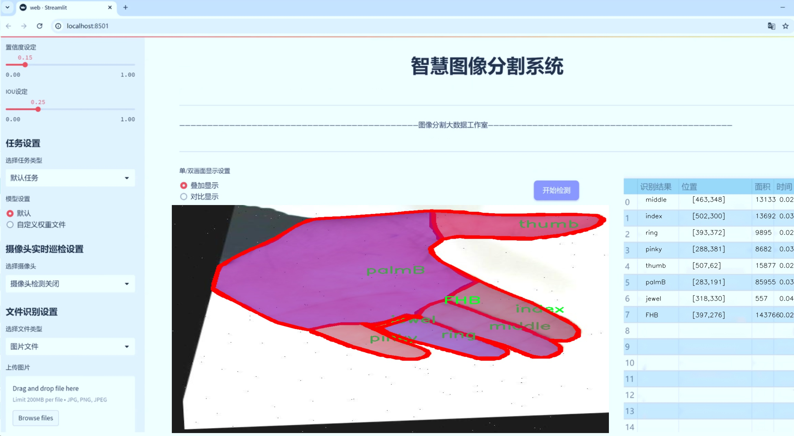
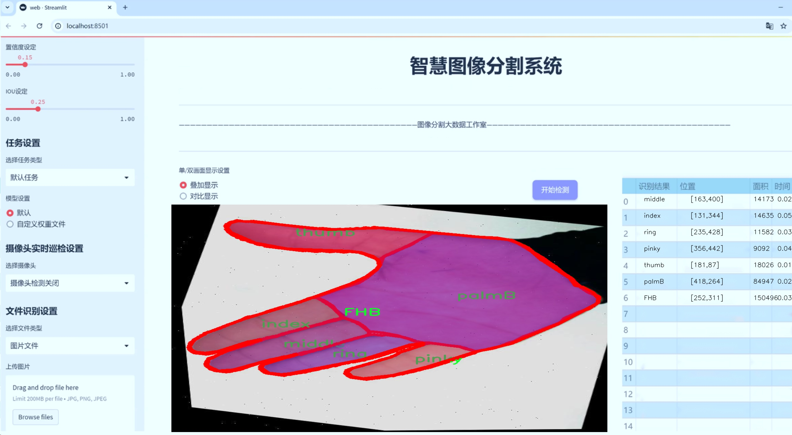
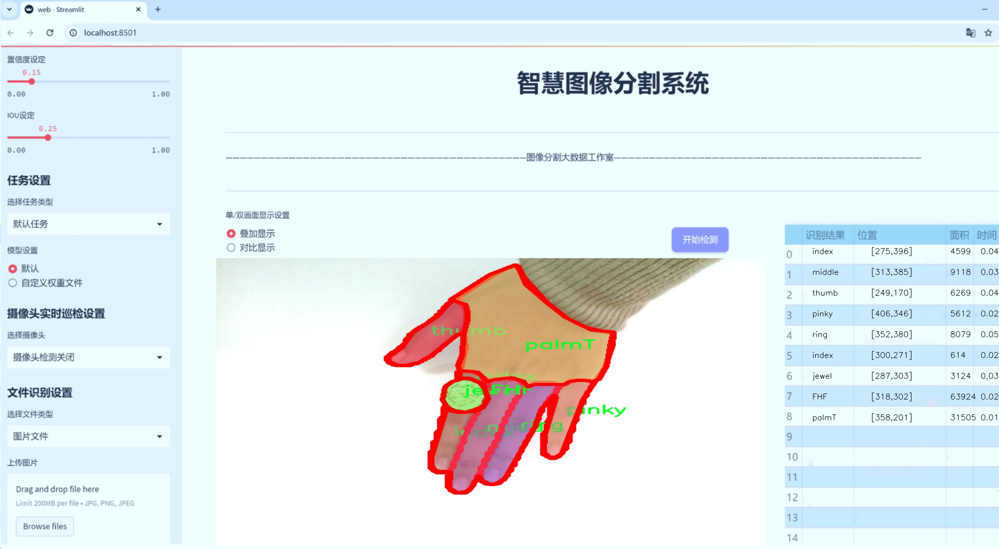
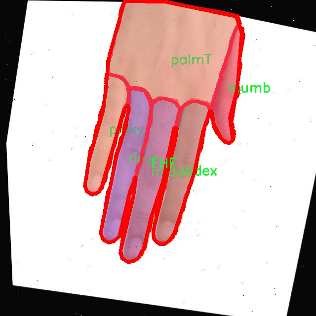
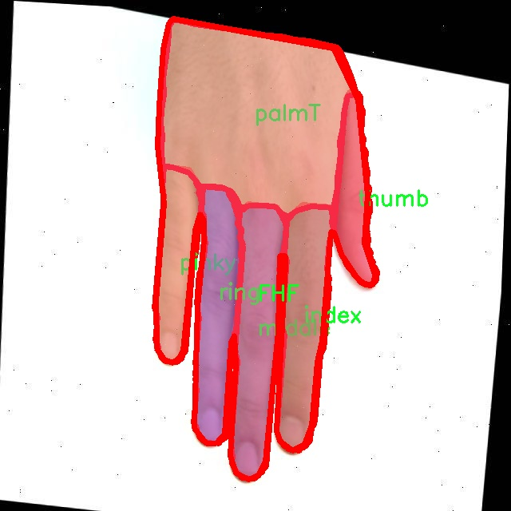
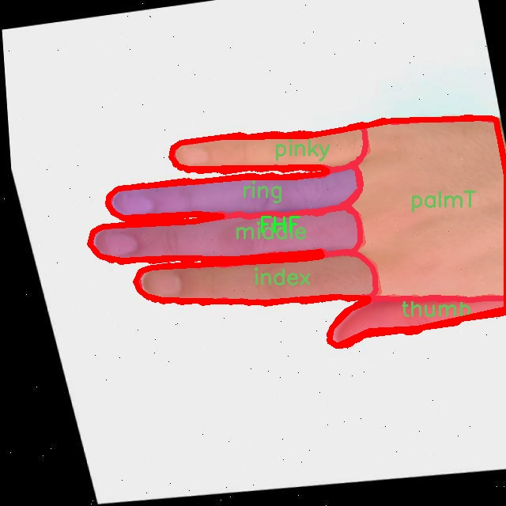
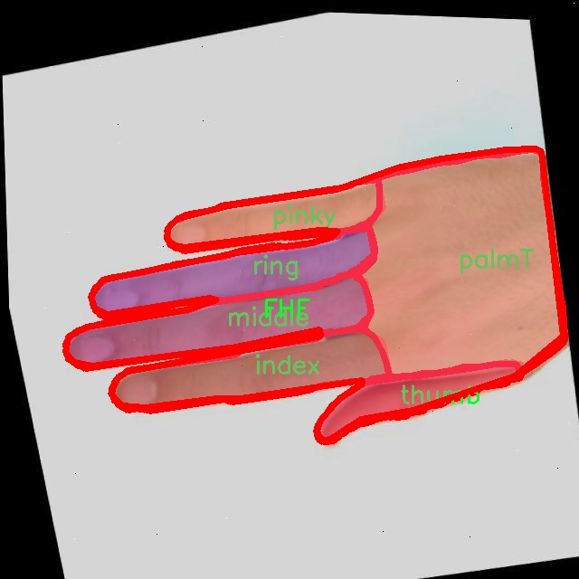
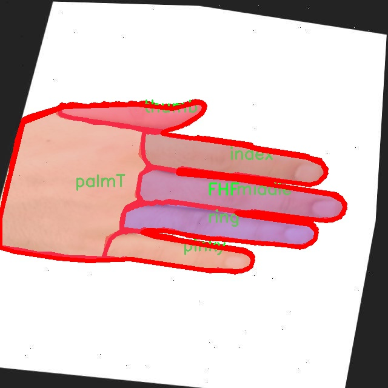

# 手指五指图像分割系统源码＆数据集分享
 [yolov8-seg-SPPF-LSKA＆yolov8-seg-C2f-EMSCP等50+全套改进创新点发刊_一键训练教程_Web前端展示]

### 1.研究背景与意义

项目参考[ILSVRC ImageNet Large Scale Visual Recognition Challenge](https://gitee.com/YOLOv8_YOLOv11_Segmentation_Studio/projects)

项目来源[AAAI Global Al lnnovation Contest](https://kdocs.cn/l/cszuIiCKVNis)

研究背景与意义

随着计算机视觉技术的迅猛发展，图像分割作为其中一项重要的研究方向，已经在多个领域展现出其广泛的应用潜力。尤其是在手部图像处理领域，手指的精准分割不仅对于人机交互、虚拟现实、增强现实等技术的实现至关重要，同时也为医疗诊断、康复训练等应用提供了重要的技术支持。近年来，YOLO（You Only Look Once）系列模型因其高效的实时目标检测能力而受到广泛关注，尤其是YOLOv8的推出，更是将目标检测与实例分割相结合，极大地提升了分割精度和速度。

本研究旨在基于改进的YOLOv8模型，构建一个高效的手指五指图像分割系统。该系统的核心在于对手指图像的精准分割，以实现对不同手指（如拇指、食指、中指、无名指和小指）的独立识别与分析。为此，我们采用了一个包含4600张手指图像的数据集，该数据集不仅涵盖了10个不同的类别（如FHB、FHF、index、jewel、middle、palmB、palmT、pinky、ring、thumb），而且每个类别都代表了手指在不同姿态、光照和背景下的表现。这种多样性为模型的训练提供了丰富的样本，确保了模型在实际应用中的鲁棒性和准确性。

在手指图像分割的研究中，传统的图像处理方法往往依赖于手工特征提取，难以适应复杂的环境变化。而基于深度学习的YOLOv8模型则通过端到端的学习方式，能够自动提取图像特征，从而实现更高效的分割效果。通过对YOLOv8的改进，我们将针对手指图像的特性，优化模型的网络结构和损失函数，以提高分割精度和处理速度。此外，结合数据增强技术，我们可以进一步扩展训练数据集，提升模型的泛化能力。

本研究的意义不仅在于推动手指图像分割技术的发展，更在于为相关应用场景提供切实可行的解决方案。例如，在医疗领域，通过对手指图像的精准分割，可以辅助医生进行手部疾病的诊断与治疗；在虚拟现实和增强现实中，精准的手指识别与跟踪能够提升用户体验，增强交互的自然性与流畅性。此外，该系统的成功实现还将为后续的手部动作识别、手势识别等研究奠定基础，推动智能交互技术的进一步发展。

综上所述，基于改进YOLOv8的手指五指图像分割系统的研究，不仅具有重要的理论价值，更具备广泛的应用前景。通过对手指图像的深入分析与处理，我们期待能够为计算机视觉领域贡献新的思路与方法，同时为实际应用提供强有力的技术支持。

### 2.图片演示







##### 注意：由于此博客编辑较早，上面“2.图片演示”和“3.视频演示”展示的系统图片或者视频可能为老版本，新版本在老版本的基础上升级如下：（实际效果以升级的新版本为准）

  （1）适配了YOLOV8的“目标检测”模型和“实例分割”模型，通过加载相应的权重（.pt）文件即可自适应加载模型。

  （2）支持“图片识别”、“视频识别”、“摄像头实时识别”三种识别模式。

  （3）支持“图片识别”、“视频识别”、“摄像头实时识别”三种识别结果保存导出，解决手动导出（容易卡顿出现爆内存）存在的问题，识别完自动保存结果并导出到tempDir中。

  （4）支持Web前端系统中的标题、背景图等自定义修改，后面提供修改教程。

  另外本项目提供训练的数据集和训练教程,暂不提供权重文件（best.pt）,需要您按照教程进行训练后实现图片演示和Web前端界面演示的效果。

### 3.视频演示

[3.1 视频演示](https://www.bilibili.com/video/BV1GcyZYeESN/)

### 4.数据集信息展示

##### 4.1 本项目数据集详细数据（类别数＆类别名）

nc: 11
names: ['FHB', 'FHF', 'index', 'jewel', 'middle', 'nail', 'palmB', 'palmT', 'pinky', 'ring', 'thumb']


##### 4.2 本项目数据集信息介绍

数据集信息展示

在本研究中，我们采用了名为“hatheli”的数据集，以训练和改进YOLOv8-seg手指五指图像分割系统。该数据集的设计旨在提供丰富的手指图像样本，涵盖了多种手指姿态和特征，以便于深度学习模型的训练和优化。数据集的类别数量为11，具体类别包括：FHB（手指后侧）、FHF（手指前侧）、index（食指）、jewel（饰品）、middle（中指）、nail（指甲）、palmB（手掌后侧）、palmT（手掌前侧）、pinky（小指）、ring（无名指）和thumb（拇指）。这些类别的设置不仅考虑到了手指的基本结构，还融入了手指在不同场景下的多样性，如佩戴饰品的情况。

“hatheli”数据集的图像样本来源广泛，涵盖了不同的肤色、性别和年龄段的个体，确保了数据的多样性和代表性。这一特性对于训练一个具有良好泛化能力的模型至关重要，因为手指的外观和特征在不同个体之间可能存在显著差异。此外，数据集中还包含了多种手指姿态和动作，例如伸展、弯曲、握拳等，旨在模拟真实生活中的各种手指使用场景。这种多样化的样本能够帮助模型更好地理解和识别手指的形态变化，从而提高分割的准确性。

在数据集的标注过程中，我们采用了精细化的标注策略，以确保每个类别的特征都得到了准确的表示。通过对每一张图像进行逐一标注，我们为每个类别创建了高质量的掩码，这些掩码将作为模型训练的基础。这样的标注方式不仅提高了数据集的质量，也为后续的模型评估提供了可靠的参考标准。

为了进一步增强模型的鲁棒性，数据集还进行了多种数据增强处理，包括旋转、缩放、翻转和颜色变换等。这些增强技术旨在模拟不同的拍摄条件和环境变化，使得模型在面对真实场景时能够表现得更加稳定和准确。通过这些手段，我们希望能够有效提升YOLOv8-seg在手指图像分割任务中的性能，使其在实际应用中能够更好地满足用户需求。

总之，“hatheli”数据集为改进YOLOv8-seg手指五指图像分割系统提供了一个坚实的基础。其丰富的类别设置和多样化的样本特征，不仅有助于提升模型的训练效果，还能在实际应用中实现更高的分割精度。通过对该数据集的深入分析和应用，我们期待能够推动手指图像分割技术的发展，为相关领域的研究和应用提供有力支持。











### 5.全套项目环境部署视频教程（零基础手把手教学）

[5.1 环境部署教程链接（零基础手把手教学）](https://www.bilibili.com/video/BV1jG4Ve4E9t/?vd_source=bc9aec86d164b67a7004b996143742dc)


[5.2 安装Python虚拟环境创建和依赖库安装视频教程链接（零基础手把手教学）](https://www.bilibili.com/video/BV1nA4VeYEze/?vd_source=bc9aec86d164b67a7004b996143742dc)

### 6.手把手YOLOV8-seg训练视频教程（零基础小白有手就能学会）

[6.1 手把手YOLOV8-seg训练视频教程（零基础小白有手就能学会）](https://www.bilibili.com/video/BV1cA4VeYETe/?vd_source=bc9aec86d164b67a7004b996143742dc)


按照上面的训练视频教程链接加载项目提供的数据集，运行train.py即可开始训练



     Epoch   gpu_mem       box       obj       cls    labels  img_size
     1/200     0G   0.01576   0.01955  0.007536        22      1280: 100%|██████████| 849/849 [14:42<00:00,  1.04s/it]
               Class     Images     Labels          P          R     mAP@.5 mAP@.5:.95: 100%|██████████| 213/213 [01:14<00:00,  2.87it/s]
                 all       3395      17314      0.994      0.957      0.0957      0.0843

     Epoch   gpu_mem       box       obj       cls    labels  img_size
     2/200     0G   0.01578   0.01923  0.007006        22      1280: 100%|██████████| 849/849 [14:44<00:00,  1.04s/it]
               Class     Images     Labels          P          R     mAP@.5 mAP@.5:.95: 100%|██████████| 213/213 [01:12<00:00,  2.95it/s]
                 all       3395      17314      0.996      0.956      0.0957      0.0845

     Epoch   gpu_mem       box       obj       cls    labels  img_size
     3/200     0G   0.01561    0.0191  0.006895        27      1280: 100%|██████████| 849/849 [10:56<00:00,  1.29it/s]
               Class     Images     Labels          P          R     mAP@.5 mAP@.5:.95: 100%|███████   | 187/213 [00:52<00:00,  4.04it/s]
                 all       3395      17314      0.996      0.957      0.0957      0.0845


### 7.50+种全套YOLOV8-seg创新点代码加载调参视频教程（一键加载写好的改进模型的配置文件）

[7.1 50+种全套YOLOV8-seg创新点代码加载调参视频教程（一键加载写好的改进模型的配置文件）](https://www.bilibili.com/video/BV1Hw4VePEXv/?vd_source=bc9aec86d164b67a7004b996143742dc)

### 8.YOLOV8-seg图像分割算法原理

原始YOLOv8-seg算法原理

YOLOv8-seg算法是计算机视觉领域中的一项重要进展，旨在实现高效的目标检测与实例分割。自2023年1月10日发布以来，YOLOv8便凭借其卓越的性能和创新的设计理念迅速成为该领域的佼佼者。该算法不仅在精度上超越了以往的模型，同时在执行速度上也展现出了显著的优势，成为了YOLO系列模型中的最新代表。

YOLOv8的设计理念是基于对YOLOv5、YOLOv6和YOLOX等前辈模型的深入分析与借鉴。它在保留YOLOv5的工程化简洁易用特性的基础上，进行了全面的结构优化和功能扩展。特别是在处理小目标检测和高分辨率图像时，YOLOv8展现出了强大的能力。这一切都得益于其在模型结构上的创新，包括引入了新的骨干网络、Anchor-Free检测头以及全新的损失函数，使得YOLOv8在各种硬件平台上都能高效运行。

在YOLOv8的核心结构中，骨干网络采用了跨阶段局部网络（CSP）思想，进一步优化了特征提取的效率。与YOLOv5相比，YOLOv8将第一个卷积层的卷积核大小从6x6缩小至3x3，这一变化使得特征提取的细腻度得到了提升。此外，YOLOv8将C3模块替换为更加轻量化的C2f模块，增加了跳层连接和Split操作，从而提高了信息流动的效率。这样的设计不仅减少了计算复杂度，还提升了模型的表达能力。

YOLOv8的特征融合采用了PAN-FPN（Path Aggregation Network - Feature Pyramid Network）结构，这一结构通过多尺度特征的融合，确保了在不同尺度下的目标检测精度。同时，YOLOv8的解耦头结构的引入，使得模型在进行目标分类和边界框回归时，能够更加独立和灵活地处理不同任务，避免了传统Anchor-Based方法中的一些局限性。

在损失函数的设计上，YOLOv8引入了新的损失策略，采用变焦损失来计算分类损失，并使用数据平均保真度损失和完美交并比损失来优化边界框的回归。这种创新的损失计算方式，使得YOLOv8在处理复杂场景时，能够更准确地定位目标，提高了检测的鲁棒性。

YOLOv8-seg算法的实例分割能力是其一大亮点。通过对图像中目标的精确分割，YOLOv8-seg不仅能够识别目标的类别，还能提供每个目标的像素级别的分割结果。这一能力在诸如自动驾驶、医学影像分析等领域具有广泛的应用前景。YOLOv8-seg通过结合高效的特征提取与精确的分割策略，使得模型在处理复杂背景和多目标场景时，依然能够保持高效的检测和分割性能。

此外，YOLOv8-seg还特别注重对小目标的检测能力。传统的目标检测算法在处理小目标时常常面临挑战，而YOLOv8通过优化的特征提取网络和新的样本匹配方式，显著提升了对小目标的识别能力。这一特性使得YOLOv8-seg在实际应用中能够更好地满足用户需求，尤其是在一些对小目标检测要求较高的场景中。

总的来说，YOLOv8-seg算法的原理是通过一系列的结构优化和创新设计，提升了目标检测与实例分割的性能。其高效的特征提取、灵活的解耦头结构、先进的损失计算策略以及对小目标的优越检测能力，使得YOLOv8-seg在计算机视觉领域中占据了重要的地位。随着技术的不断进步，YOLOv8-seg有望在更多实际应用中发挥更大的作用，推动计算机视觉技术的进一步发展。


### 9.系统功能展示（检测对象为举例，实际内容以本项目数据集为准）

图9.1.系统支持检测结果表格显示

  图9.2.系统支持置信度和IOU阈值手动调节

  图9.3.系统支持自定义加载权重文件best.pt(需要你通过步骤5中训练获得)

  图9.4.系统支持摄像头实时识别

  图9.5.系统支持图片识别

  图9.6.系统支持视频识别

  图9.7.系统支持识别结果文件自动保存

  图9.8.系统支持Excel导出检测结果数据


### 10.50+种全套YOLOV8-seg创新点原理讲解（非科班也可以轻松写刊发刊，V11版本正在科研待更新）

#### 10.1 由于篇幅限制，每个创新点的具体原理讲解就不一一展开，具体见下列网址中的创新点对应子项目的技术原理博客网址【Blog】：


[10.1 50+种全套YOLOV8-seg创新点原理讲解链接](https://gitee.com/qunmasj/good)

#### 10.2 部分改进模块原理讲解(完整的改进原理见上图和技术博客链接)【如果此小节的图加载失败可以通过CSDN或者Github搜索该博客的标题访问原始博客，原始博客图片显示正常】
### YOLOv8简介
目前YOLO系列的SOTA模型是ultralytics公司于2023年发布的YOLOv8.按照模型宽度和深度不同分为YOLOv8n、YOLOv8s、YOLOv8m、YOLOv81、YOLOv8x五个版本。本文改进的是 YOLOv8n模型。
YOLOv8的 Backbone采用CSPDarknet结构，它是 Darknet 的一种改进，引入CSP改善网络结构。CSPDarknet把特征图分为两部分，一部分进行卷积操作，另一部分进行跳跃连接，在保持网络深度的同时减少参数量和计算量，提高网络效率。Neck 部分采用特征金字塔PANet[17]，通过自顶向下路径结合和自底向上特征传播进行多尺度融合。损失函数采用了CIloU[18]。YOLOv8的网络结构如图所示。


### ParC融合位置感知循环卷积简介
ParC：Position aware circular convolution


#### Position aware circular convolution
针对于全局信息的提取作者提出了Position aware circular convolution（也称作Global Circular Convolution）。图中左右实际是对于该操作水平竖直两方向的对称，理解时只看左边即可。对于维度为C*H*W的输入，作者先将维度为C*B*1的Position Embedding通过双线性插值函数F调整到适合input的维度C*H*1（以适应不同特征大小输入），并且将PE水平复制扩展到C*H*W维度与输入特征相加。这里作者将PE直接设置成为了可学习的参数。

接下来参考该博客将加入PE的特征图竖直方向堆叠，并且同样以插值的方式得到了适应输入维度的C*H*1大小的卷积核，进行卷积操作。对于这一步卷积，作者将之称为循环卷积，并给出了一个卷积示意图。


但个人感觉实际上这个示意图只是为了说明为什么叫循环卷积，对于具体的计算细节还是根据公式理解更好。


进一步，作者给出了这一步的伪代码来便于读者对这一卷积的理解：y=F.conv2D（torch.cat（xp，xp，dim=2），kV），实际上就是将xp堆叠之后使用了一个“条形（或柱形）”卷积核进行简单的卷积操作。（但这样会导致多一次重复卷积，因此在堆叠示意图中只取了前2*H-1行）

可以看到在示意图中特征维度变化如下：C*(2H-1)*W ---C*H*1--->C*H*W，作者特意带上了通道数，并且并没有出现通道数的改变，那么这里所进行的卷积应该是depth wise卷积，通过对文章后续以及论文源码的阅读可以得知这一步进行的就是DW卷积。（we introduce group convolution and point wise convolution into these modules, which decreases number of parameters without hurting performance.）


由groups = channel可知使用的是DW卷积
通过上面就完成了一次竖直方向的全局信息交流，同样只要在水平方向进行同样的操作即可做到水平方向的全局信息交流。

#### ParC block

通过ParC成功解决了全局信息提取的问题，接下来就是针对2）3）两点进行改进。首先是Meta-Former模块，Meta-Former由Token Mixer和Channel Mixer构成，ParC首先满足了Token Mixer的全局信息提取的要求，并且相较于Attention在计算成本上更低。


这里①中的PWC即point wise conv，进一步验证了我们前面对于深度可分离卷积的想法，而GCC-H/V即是前面所说的ParC-H/V。

①构建了Meta-Former中的Token mixer模块，那么最后剩下的问题就是3），替换掉Attention模块之后模型不再data driven。为了解决这一点作者给出了一个channel wise attention，先将特征图（x,C*H*W）进行global average（a,C*1*1）并输入一个MLP生成一个channel wise的权重（w,C*1*1），再将权重与特征图在通道方向相乘得到输出（output = wx,C*H*W）。

#### ParC net
对于ParC net 的搭建，作者直接基于MobileViT，采用了分叉结构（c）完成了网络的搭建。


具体而言作者保留了MobileViT中浅层具有局部感受野的MobileNetV2结构，而将网络深层的ViT block替换成了ParC block，使网络变成了一个pure ConvNet。


### 11.项目核心源码讲解（再也不用担心看不懂代码逻辑）

#### 11.1 ui.py

以下是经过简化和注释的核心代码：

```python
import sys
import subprocess

def run_script(script_path):
    """
    使用当前 Python 环境运行指定的脚本。

    Args:
        script_path (str): 要运行的脚本路径
    """
    # 获取当前 Python 解释器的路径
    python_path = sys.executable

    # 构建运行命令，使用 streamlit 运行指定的脚本
    command = f'"{python_path}" -m streamlit run "{script_path}"'

    # 执行命令
    result = subprocess.run(command, shell=True)
    # 检查命令执行结果，如果返回码不为0，表示出错
    if result.returncode != 0:
        print("脚本运行出错。")

# 程序入口
if __name__ == "__main__":
    # 指定要运行的脚本路径
    script_path = "web.py"  # 这里可以直接指定脚本路径

    # 调用函数运行脚本
    run_script(script_path)
```

### 代码注释说明：
1. **导入模块**：
   - `sys`：用于获取当前 Python 解释器的路径。
   - `subprocess`：用于执行外部命令。

2. **`run_script` 函数**：
   - 接收一个参数 `script_path`，表示要运行的 Python 脚本的路径。
   - 使用 `sys.executable` 获取当前 Python 解释器的路径。
   - 构建一个命令字符串，用于通过 `streamlit` 运行指定的脚本。
   - 使用 `subprocess.run` 执行构建的命令，并检查执行结果。如果返回码不为0，打印错误信息。

3. **程序入口**：
   - 使用 `if __name__ == "__main__":` 确保只有在直接运行该脚本时才会执行以下代码。
   - 指定要运行的脚本路径（这里为 `web.py`）。
   - 调用 `run_script` 函数来执行指定的脚本。

这个程序文件 `ui.py` 是一个用于运行指定 Python 脚本的工具，主要是通过 Streamlit 框架来启动一个 Web 应用。程序的核心功能是通过调用系统命令来执行一个 Python 脚本，并且能够处理可能出现的错误。

首先，程序导入了必要的模块，包括 `sys`、`os` 和 `subprocess`。其中，`sys` 模块用于获取当前 Python 解释器的路径，`subprocess` 模块则用于执行系统命令。`os` 模块在这里没有直接使用，但可能是为了后续扩展或处理文件路径。

接下来，定义了一个名为 `run_script` 的函数，该函数接受一个参数 `script_path`，表示要运行的脚本的路径。在函数内部，首先通过 `sys.executable` 获取当前 Python 解释器的路径。然后，构建一个命令字符串，该命令使用 Streamlit 框架来运行指定的脚本。命令的格式是 `"{python_path}" -m streamlit run "{script_path}"`，其中 `{python_path}` 和 `{script_path}` 会被实际的路径替换。

接着，使用 `subprocess.run` 方法执行构建好的命令。这个方法会在新的 shell 中运行命令，并等待其完成。执行后，程序检查返回码 `result.returncode`，如果返回码不为 0，表示脚本运行过程中出现了错误，此时会打印出一条错误信息。

最后，在 `if __name__ == "__main__":` 语句块中，程序指定了要运行的脚本路径，这里使用了 `abs_path("web.py")` 来获取 `web.py` 的绝对路径。然后调用 `run_script` 函数来执行这个脚本。

总的来说，这个程序的功能是提供一个简单的接口来运行 Streamlit 应用，能够自动处理脚本路径并反馈运行状态。

#### 11.2 ultralytics\nn\extra_modules\ops_dcnv3\test.py

以下是经过简化和注释的核心代码部分，主要关注于前向和反向传播的验证，以及时间成本的检查。

```python
import time
import torch
from functions.dcnv3_func import DCNv3Function, dcnv3_core_pytorch

# 输入和输出的尺寸参数
H_in, W_in = 8, 8  # 输入图像的高度和宽度
N, M, D = 2, 4, 16  # 批量大小、输出通道数和深度
Kh, Kw = 3, 3  # 卷积核的高度和宽度
remove_center = False  # 是否移除中心点
P = Kh * Kw - remove_center  # 卷积核的有效点数
offset_scale = 2.0  # 偏移量的缩放因子
pad = 1  # 填充
dilation = 1  # 膨胀
stride = 1  # 步幅
H_out = (H_in + 2 * pad - (dilation * (Kh - 1) + 1)) // stride + 1  # 输出高度
W_out = (W_in + 2 * pad - (dilation * (Kw - 1) + 1)) // stride + 1  # 输出宽度

torch.manual_seed(3)  # 设置随机种子以确保可重复性

@torch.no_grad()
def check_forward_equal_with_pytorch_double():
    # 生成随机输入、偏移量和掩码
    input = torch.rand(N, H_in, W_in, M*D).cuda() * 0.01
    offset = torch.rand(N, H_out, W_out, M*P*2).cuda() * 10
    mask = torch.rand(N, H_out, W_out, M, P).cuda() + 1e-5
    mask /= mask.sum(-1, keepdim=True)  # 归一化掩码
    mask = mask.reshape(N, H_out, W_out, M*P)

    # 使用PyTorch的实现进行前向传播
    output_pytorch = dcnv3_core_pytorch(
        input.double(),
        offset.double(),
        mask.double(),
        Kh, Kw, stride, stride, Kh // 2, Kw // 2, dilation, dilation, M, D, offset_scale, remove_center).detach().cpu()

    # 使用自定义的DCNv3实现进行前向传播
    output_cuda = DCNv3Function.apply(
        input.double(),
        offset.double(),
        mask.double(),
        Kh, Kw, stride, stride, Kh // 2, Kw // 2, dilation, dilation, M, D, offset_scale,
        im2col_step=2, remove_center).detach().cpu()

    # 检查两个输出是否相近
    fwdok = torch.allclose(output_cuda, output_pytorch)
    max_abs_err = (output_cuda - output_pytorch).abs().max()  # 最大绝对误差
    max_rel_err = ((output_cuda - output_pytorch).abs() / output_pytorch.abs()).max()  # 最大相对误差
    print('>>> forward double')
    print(f'* {fwdok} check_forward_equal_with_pytorch_double: max_abs_err {max_abs_err:.2e} max_rel_err {max_rel_err:.2e}')

@torch.no_grad()
def check_time_cost(im2col_step=128):
    # 检查前向传播的时间成本
    N = 512  # 批量大小
    H_in, W_in = 64, 64  # 输入图像的高度和宽度
    H_out = (H_in + 2 * pad - (dilation * (Kh - 1) + 1)) // stride + 1  # 输出高度
    W_out = (W_in + 2 * pad - (dilation * (Kw - 1) + 1)) // stride + 1  # 输出宽度

    # 生成随机输入、偏移量和掩码
    input = torch.rand(N, H_in, W_in, M*D).cuda() * 0.01
    offset = torch.rand(N, H_out, W_out, M*P*2).cuda() * 10
    mask = torch.rand(N, H_out, W_out, M, P).cuda() + 1e-5
    mask /= mask.sum(-1, keepdim=True)
    mask = mask.reshape(N, H_out, W_out, M*P)

    print(f'>>> time cost: im2col_step {im2col_step}; input {input.shape}; points {P} ')
    repeat = 100  # 重复次数
    for i in range(repeat):
        output_cuda = DCNv3Function.apply(
            input,
            offset,
            mask,
            Kh, Kw, stride, stride, Kh // 2, Kw // 2, dilation, dilation, M, D, 1.0,
            im2col_step, remove_center)
    torch.cuda.synchronize()  # 确保CUDA操作完成
    start = time.time()  # 记录开始时间
    for i in range(repeat):
        output_cuda = DCNv3Function.apply(
            input,
            offset,
            mask,
            Kh, Kw, stride, stride, Kh // 2, Kw // 2, dilation, dilation, M, D, 1.0,
            im2col_step, remove_center)
    torch.cuda.synchronize()  # 确保CUDA操作完成
    print(f'foward time cost: {(time.time() - start) / repeat}')  # 输出平均时间成本

if __name__ == '__main__':
    check_forward_equal_with_pytorch_double()  # 检查双精度前向传播
    check_time_cost(im2col_step=128)  # 检查时间成本
```

### 代码说明：
1. **参数设置**：定义了输入和输出的尺寸参数，包括输入图像的高度和宽度、批量大小、卷积核的尺寸等。
2. **前向传播检查**：`check_forward_equal_with_pytorch_double` 函数生成随机输入、偏移量和掩码，并使用PyTorch的实现和自定义的DCNv3实现进行前向传播，最后比较两者的输出是否相近。
3. **时间成本检查**：`check_time_cost` 函数用于评估前向传播的时间成本，通过多次重复调用来计算平均时间。

这个程序文件是一个用于测试和验证深度学习中DCNv3（Deformable Convolutional Networks v3）功能的脚本。它主要包含了前向和反向传播的验证，以及性能测试。程序中使用了PyTorch库，特别是其自动求导和CUDA功能。

首先，程序导入了一些必要的库，包括时间处理、PyTorch的核心模块和自定义的DCNv3函数。接着，定义了一些输入参数，例如输入图像的高度和宽度（H_in, W_in），通道数（N, M, D），卷积核的大小（Kh, Kw），以及其他与卷积操作相关的参数（如padding、dilation、stride等）。这些参数的设置将影响卷积操作的输出尺寸和计算方式。

程序中定义了多个函数来进行不同的测试。`check_forward_equal_with_pytorch_double`和`check_forward_equal_with_pytorch_float`分别用于验证使用双精度和单精度浮点数的前向传播结果是否一致。它们通过生成随机输入、偏移量和掩码，调用自定义的DCNv3核心函数和PyTorch的实现进行比较，输出最大绝对误差和相对误差。

接下来的`check_backward_equal_with_pytorch_double`和`check_backward_equal_with_pytorch_float`函数则用于验证反向传播的梯度计算是否一致。它们同样生成随机输入，并在计算输出后进行反向传播，比较计算得到的梯度与PyTorch实现的梯度。

最后，`check_time_cost`函数用于测量DCNv3操作的时间开销。它生成较大的输入数据并多次调用DCNv3函数，以便评估在不同的im2col步骤下的性能。

在`__main__`部分，程序依次调用上述函数进行测试，确保实现的正确性和性能。通过这些测试，开发者可以确认DCNv3的实现与PyTorch的标准实现之间的一致性，并评估其在不同条件下的性能表现。

#### 11.3 ultralytics\models\fastsam\prompt.py

以下是经过简化和注释的核心代码部分，主要保留了与图像分割和处理相关的功能：

```python
import os
import numpy as np
import torch
from PIL import Image
import cv2

class FastSAMPrompt:
    """
    Fast Segment Anything Model类，用于图像注释和可视化。

    属性:
        device (str): 计算设备（'cuda'或'cpu'）。
        results: 目标检测或分割结果。
        source: 源图像或图像路径。
        clip: 用于线性分配的CLIP模型。
    """

    def __init__(self, source, results, device='cuda') -> None:
        """初始化FastSAMPrompt，设置源图像、结果和设备，并导入CLIP模型。"""
        self.device = device
        self.results = results
        self.source = source

        # 导入CLIP模型
        try:
            import clip  # 用于线性分配
        except ImportError:
            from ultralytics.utils.checks import check_requirements
            check_requirements('git+https://github.com/openai/CLIP.git')
            import clip
        self.clip = clip

    @staticmethod
    def _segment_image(image, bbox):
        """根据提供的边界框坐标对给定图像进行分割。"""
        image_array = np.array(image)
        segmented_image_array = np.zeros_like(image_array)  # 创建与原图相同大小的全黑图像
        x1, y1, x2, y2 = bbox  # 解包边界框坐标
        segmented_image_array[y1:y2, x1:x2] = image_array[y1:y2, x1:x2]  # 仅保留边界框内的区域
        segmented_image = Image.fromarray(segmented_image_array)  # 转换为PIL图像
        black_image = Image.new('RGB', image.size, (255, 255, 255))  # 创建白色背景图像
        transparency_mask = np.zeros((image_array.shape[0], image_array.shape[1]), dtype=np.uint8)  # 创建透明度掩码
        transparency_mask[y1:y2, x1:x2] = 255  # 设置边界框区域为不透明
        transparency_mask_image = Image.fromarray(transparency_mask, mode='L')  # 转换为PIL图像
        black_image.paste(segmented_image, mask=transparency_mask_image)  # 将分割区域粘贴到白色背景上
        return black_image

    @staticmethod
    def _format_results(result, filter=0):
        """将检测结果格式化为包含ID、分割、边界框、分数和面积的注释列表。"""
        annotations = []
        n = len(result.masks.data) if result.masks is not None else 0  # 获取掩码数量
        for i in range(n):
            mask = result.masks.data[i] == 1.0  # 获取当前掩码
            if torch.sum(mask) >= filter:  # 过滤掉小于阈值的掩码
                annotation = {
                    'id': i,
                    'segmentation': mask.cpu().numpy(),
                    'bbox': result.boxes.data[i],
                    'score': result.boxes.conf[i]}
                annotation['area'] = annotation['segmentation'].sum()  # 计算掩码面积
                annotations.append(annotation)  # 添加到注释列表
        return annotations

    def plot(self, annotations, output):
        """
        在图像上绘制注释、边界框，并保存输出。

        参数:
            annotations (list): 要绘制的注释。
            output (str): 保存绘图的输出目录。
        """
        for ann in annotations:
            result_name = os.path.basename(ann.path)  # 获取结果名称
            image = ann.orig_img[..., ::-1]  # BGR转RGB
            plt.figure(figsize=(image.shape[1] / 100, image.shape[0] / 100))  # 设置图像大小
            plt.imshow(image)  # 显示图像

            if ann.masks is not None:
                masks = ann.masks.data  # 获取掩码数据
                for mask in masks:
                    plt.imshow(mask, alpha=0.5)  # 绘制掩码

            # 保存图像
            save_path = os.path.join(output, result_name)
            plt.axis('off')
            plt.savefig(save_path, bbox_inches='tight', pad_inches=0, transparent=True)
            plt.close()

    @torch.no_grad()
    def retrieve(self, model, preprocess, elements, search_text: str) -> int:
        """处理图像和文本，计算相似度，并返回softmax分数。"""
        preprocessed_images = [preprocess(image).to(self.device) for image in elements]  # 预处理图像
        tokenized_text = self.clip.tokenize([search_text]).to(self.device)  # 对文本进行编码
        stacked_images = torch.stack(preprocessed_images)  # 堆叠图像
        image_features = model.encode_image(stacked_images)  # 编码图像特征
        text_features = model.encode_text(tokenized_text)  # 编码文本特征
        image_features /= image_features.norm(dim=-1, keepdim=True)  # 归一化图像特征
        text_features /= text_features.norm(dim=-1, keepdim=True)  # 归一化文本特征
        probs = 100.0 * image_features @ text_features.T  # 计算相似度
        return probs[:, 0].softmax(dim=0)  # 返回softmax分数
```

### 代码说明：
1. **类的定义**：`FastSAMPrompt`类用于处理图像分割和注释。
2. **初始化方法**：设置设备、源图像和结果，并导入CLIP模型。
3. **图像分割**：`_segment_image`方法根据边界框对图像进行分割。
4. **结果格式化**：`_format_results`方法将检测结果转换为包含重要信息的注释列表。
5. **绘图方法**：`plot`方法在图像上绘制注释和掩码，并保存结果。
6. **相似度检索**：`retrieve`方法处理图像和文本，计算它们之间的相似度。

以上是核心功能的实现，其他方法和功能可以根据需要进行扩展或调整。

这个程序文件定义了一个名为 `FastSAMPrompt` 的类，主要用于图像注释和可视化，结合了快速分割模型（Fast Segment Anything Model）和 CLIP 模型。类的构造函数接收源图像、检测结果和计算设备（如 CUDA 或 CPU）作为参数，并尝试导入 CLIP 模型以进行线性分配。

该类包含多个静态方法和实例方法。静态方法包括 `_segment_image`，用于根据给定的边界框对图像进行分割；`_format_results`，将检测结果格式化为包含 ID、分割、边界框、得分和面积的注释列表；`_get_bbox_from_mask`，通过形态学变换从掩码中获取边界框。

`plot` 方法用于在图像上绘制注释、边界框和点，并将结果保存到指定的输出目录。它使用 matplotlib 库来处理图像的可视化，并支持多种参数选项，例如是否使用随机颜色、是否应用形态学变换等。

`fast_show_mask` 方法快速显示掩码注释，支持自定义颜色和透明度，并可以绘制边界框和点。`retrieve` 方法则处理图像和文本，计算相似度并返回 softmax 分数。

此外，类中还有一些用于裁剪图像和处理用户输入的提示方法，如 `box_prompt`、`point_prompt` 和 `text_prompt`。这些方法根据用户提供的边界框、点或文本，调整掩码并返回更新后的结果。

最后，`everything_prompt` 方法返回处理后的结果，便于后续使用。整体而言，这个类提供了一整套图像分割和注释的工具，结合了深度学习模型的能力，能够高效地处理和可视化图像数据。

#### 11.4 ultralytics\utils\checks.py

以下是代码中最核心的部分，并附上详细的中文注释：

```python
import os
import platform
import subprocess
import sys
from pathlib import Path
from typing import Optional

import torch
from ultralytics.utils import LOGGER, ROOT, colorstr, TryExcept, is_pip_package

def check_python(minimum: str = '3.8.0') -> bool:
    """
    检查当前 Python 版本是否满足最低要求。

    参数:
        minimum (str): 要求的最低 Python 版本。

    返回:
        bool: 如果当前版本满足要求则返回 True，否则返回 False。
    """
    current_version = platform.python_version()  # 获取当前 Python 版本
    if current_version < minimum:
        LOGGER.warning(f'WARNING ⚠️ 当前 Python 版本 {current_version} 低于要求的最低版本 {minimum}')
        return False
    return True

@TryExcept()
def check_requirements(requirements=ROOT.parent / 'requirements.txt', exclude=(), install=True, cmds=''):
    """
    检查已安装的依赖项是否满足要求，并尝试自动更新。

    参数:
        requirements (Union[Path, str, List[str]]): requirements.txt 文件的路径，单个包要求字符串，或包要求字符串列表。
        exclude (Tuple[str]): 要排除的包名称元组。
        install (bool): 如果为 True，尝试自动更新不满足要求的包。
        cmds (str): 在自动更新时传递给 pip install 命令的附加命令。

    返回:
        bool: 如果所有要求都满足则返回 True，否则返回 False。
    """
    prefix = colorstr('red', 'bold', 'requirements:')
    check_python()  # 检查 Python 版本
    if isinstance(requirements, Path):  # 如果是 requirements.txt 文件
        file = requirements.resolve()
        assert file.exists(), f'{prefix} {file} not found, check failed.'
        requirements = [f'{x.name}{x.specifier}' for x in parse_requirements(file) if x.name not in exclude]
    elif isinstance(requirements, str):
        requirements = [requirements]

    pkgs = []  # 存储不满足要求的包
    for r in requirements:
        r_stripped = r.split('/')[-1].replace('.git', '')  # 处理 git 包
        match = re.match(r'([a-zA-Z0-9-_]+)([<>!=~]+.*)?', r_stripped)
        name, required = match[1], match[2].strip() if match[2] else ''
        try:
            assert check_version(metadata.version(name), required)  # 检查版本是否满足要求
        except (AssertionError, metadata.PackageNotFoundError):
            pkgs.append(r)  # 如果不满足要求，则添加到包列表

    s = ' '.join(f'"{x}"' for x in pkgs)  # 将不满足要求的包转换为字符串
    if s:
        if install and AUTOINSTALL:  # 检查环境变量
            n = len(pkgs)  # 更新的包数量
            LOGGER.info(f"{prefix} Ultralytics requirement{'s' * (n > 1)} {pkgs} not found, attempting AutoUpdate...")
            try:
                t = time.time()
                assert is_online(), 'AutoUpdate skipped (offline)'  # 检查是否在线
                LOGGER.info(subprocess.check_output(f'pip install --no-cache {s} {cmds}', shell=True).decode())
                dt = time.time() - t
                LOGGER.info(
                    f"{prefix} AutoUpdate success ✅ {dt:.1f}s, installed {n} package{'s' * (n > 1)}: {pkgs}\n"
                    f"{prefix} ⚠️ {colorstr('bold', 'Restart runtime or rerun command for updates to take effect')}\n")
            except Exception as e:
                LOGGER.warning(f'{prefix} ❌ {e}')
                return False
        else:
            return False

    return True

def check_version(current: str = '0.0.0',
                  required: str = '0.0.0',
                  name: str = 'version',
                  hard: bool = False,
                  verbose: bool = False) -> bool:
    """
    检查当前版本是否满足要求的版本或范围。

    参数:
        current (str): 当前版本或要获取版本的包名称。
        required (str): 要求的版本或范围（以 pip 风格格式）。
        name (str, optional): 在警告消息中使用的名称。
        hard (bool, optional): 如果为 True，当要求不满足时引发 AssertionError。
        verbose (bool, optional): 如果为 True，当要求不满足时打印警告消息。

    返回:
        bool: 如果要求满足则返回 True，否则返回 False。
    """
    if not current:  # 如果当前版本为空
        LOGGER.warning(f'WARNING ⚠️ invalid check_version({current}, {required}) requested, please check values.')
        return True
    elif not current[0].isdigit():  # 如果当前是包名称而不是版本字符串
        try:
            name = current  # 将包名称赋值给 'name' 参数
            current = metadata.version(current)  # 从包名称获取版本字符串
        except metadata.PackageNotFoundError:
            if hard:
                raise ModuleNotFoundError(f'WARNING ⚠️ {current} package is required but not installed')
            else:
                return False

    if not required:  # 如果要求为空
        return True

    result = True
    c = parse_version(current)  # 将版本字符串解析为元组
    for r in required.strip(',').split(','):
        op, v = re.match(r'([^0-9]*)([\d.]+)', r).groups()  # 分离操作符和版本号
        v = parse_version(v)  # 将版本字符串解析为元组
        if op == '==' and c != v:
            result = False
        elif op == '!=' and c == v:
            result = False
        elif op in ('>=', '') and not (c >= v):  # 如果没有传递约束，假设 '>=required'
            result = False
        elif op == '<=' and not (c <= v):
            result = False
        elif op == '>' and not (c > v):
            result = False
        elif op == '<' and not (c < v):
            result = False
    if not result:
        warning_message = f'WARNING ⚠️ {name}{op}{required} is required, but {name}=={current} is currently installed'
        if hard:
            raise ModuleNotFoundError(warning_message)  # 确保版本要求满足
        if verbose:
            LOGGER.warning(warning_message)
    return result

def check_latest_pypi_version(package_name='ultralytics'):
    """
    返回 PyPI 包的最新版本，而不下载或安装它。

    参数:
        package_name (str): 要查找最新版本的包名称。

    返回:
        str: 包的最新版本。
    """
    try:
        response = requests.get(f'https://pypi.org/pypi/{package_name}/json', timeout=3)
        if response.status_code == 200:
            return response.json()['info']['version']
    except Exception:
        return None
```

### 代码核心部分说明
1. **check_python**: 检查当前 Python 版本是否满足最低要求。
2. **check_requirements**: 检查依赖项是否满足要求，并在需要时尝试自动更新。
3. **check_version**: 检查当前版本是否满足指定的版本要求。
4. **check_latest_pypi_version**: 获取指定 PyPI 包的最新版本信息。

这些函数是确保环境和依赖项正确设置的关键部分，对于任何依赖于此代码的项目都是至关重要的。

这个程序文件 `ultralytics/utils/checks.py` 是 Ultralytics YOLO 项目的一部分，主要用于检查和验证环境、依赖关系、版本以及一些配置，以确保 YOLO 模型能够正常运行。以下是对该文件中各个函数的详细说明。

首先，文件导入了一系列必要的库，包括标准库（如 `os`、`re`、`subprocess` 等）和第三方库（如 `torch`、`cv2`、`numpy` 等），这些库提供了文件操作、正则表达式处理、子进程管理、图像处理等功能。

`parse_requirements` 函数用于解析 `requirements.txt` 文件，提取出所需的 Python 包及其版本信息。它会忽略以 `#` 开头的注释行，并返回一个包含包名和版本要求的字典列表。

`parse_version` 函数将版本字符串转换为整数元组，方便进行版本比较。它会提取出版本号中的数字部分，并返回一个元组，例如将 `'2.0.1+cpu'` 转换为 `(2, 0, 1)`。

`is_ascii` 函数检查给定字符串是否仅由 ASCII 字符组成，返回布尔值。

`check_imgsz` 函数验证图像尺寸是否为给定步幅的倍数，并根据需要调整图像尺寸，以确保其符合模型输入要求。

`check_version` 函数用于检查当前版本是否满足所需版本要求，可以指定严格模式和详细模式。

`check_latest_pypi_version` 函数从 PyPI 获取指定包的最新版本信息，而 `check_pip_update_available` 函数则检查当前安装的 `ultralytics` 包是否有可用更新。

`check_font` 函数用于查找本地字体文件，如果未找到，则从指定 URL 下载字体。

`check_python` 函数检查当前 Python 版本是否满足最低要求。

`check_requirements` 函数检查已安装的依赖项是否满足 YOLOv8 的要求，并在需要时尝试自动更新。

`check_torchvision` 函数检查已安装的 PyTorch 和 Torchvision 版本是否兼容。

`check_suffix` 函数检查文件的后缀是否符合要求。

`check_yolov5u_filename` 函数用于将旧版 YOLOv5 文件名替换为新版 YOLOv5u 文件名。

`check_file` 函数用于查找或下载指定文件，并返回其路径。

`check_yaml` 函数类似于 `check_file`，但专门用于 YAML 文件。

`check_imshow` 函数检查当前环境是否支持图像显示。

`check_yolo` 函数返回 YOLO 软件和硬件的可读性摘要，并输出系统信息。

`collect_system_info` 函数收集并打印系统相关信息，包括操作系统、Python 版本、内存、CPU 和 CUDA 状态。

`check_amp` 函数检查 PyTorch 的自动混合精度（AMP）功能是否正常，确保在训练时不会出现 NaN 损失或零 mAP 结果。

`git_describe` 函数返回人类可读的 Git 描述信息。

`print_args` 函数用于打印函数参数，支持可选的参数字典。

`cuda_device_count` 函数获取可用的 NVIDIA GPU 数量。

`cuda_is_available` 函数检查 CUDA 是否在环境中可用。

整体来看，这个文件的主要目的是确保 YOLO 模型在运行时具备正确的环境和依赖，提供了一系列的检查和验证功能，以便用户能够顺利地使用 YOLO 进行目标检测任务。

#### 11.5 train.py

以下是代码中最核心的部分，并附上详细的中文注释：

```python
import os
import torch
import yaml
from ultralytics import YOLO  # 导入YOLO模型库

if __name__ == '__main__':  # 确保该模块被直接运行时才执行以下代码
    # 设置训练参数
    workers = 1  # 数据加载的工作进程数
    batch = 8  # 每个批次的样本数量
    device = "0" if torch.cuda.is_available() else "cpu"  # 判断是否使用GPU

    # 获取数据集配置文件的绝对路径
    data_path = abs_path(f'datasets/data/data.yaml', path_type='current')

    # 将路径格式转换为Unix风格
    unix_style_path = data_path.replace(os.sep, '/')
    # 获取数据集目录路径
    directory_path = os.path.dirname(unix_style_path)

    # 读取YAML文件，保持原有顺序
    with open(data_path, 'r') as file:
        data = yaml.load(file, Loader=yaml.FullLoader)

    # 修改数据集路径
    if 'train' in data and 'val' in data and 'test' in data:
        data['train'] = directory_path + '/train'  # 设置训练集路径
        data['val'] = directory_path + '/val'      # 设置验证集路径
        data['test'] = directory_path + '/test'    # 设置测试集路径

        # 将修改后的数据写回YAML文件
        with open(data_path, 'w') as file:
            yaml.safe_dump(data, file, sort_keys=False)

    # 加载YOLO模型配置文件和预训练权重
    model = YOLO(r"C:\codeseg\codenew\50+种YOLOv8算法改进源码大全和调试加载训练教程（非必要）\改进YOLOv8模型配置文件\yolov8-seg-C2f-Faster.yaml").load("./weights/yolov8s-seg.pt")

    # 开始训练模型
    results = model.train(
        data=data_path,  # 指定训练数据的配置文件路径
        device=device,  # 指定使用的设备（GPU或CPU）
        workers=workers,  # 指定数据加载的工作进程数
        imgsz=640,  # 指定输入图像的大小为640x640
        epochs=100,  # 指定训练的轮数为100
        batch=batch,  # 指定每个批次的大小
    )
```

### 代码注释说明：
1. **导入必要的库**：导入`os`、`torch`、`yaml`和YOLO模型库，确保可以使用这些库中的功能。
2. **主程序入口**：使用`if __name__ == '__main__':`确保只有在直接运行该脚本时才会执行以下代码。
3. **设置训练参数**：定义数据加载的工作进程数、批次大小和设备（GPU或CPU）。
4. **获取数据集配置文件路径**：使用`abs_path`函数获取数据集配置文件的绝对路径。
5. **读取和修改YAML文件**：读取YAML文件，修改训练、验证和测试集的路径，并将修改后的内容写回文件。
6. **加载YOLO模型**：根据指定的配置文件和预训练权重加载YOLO模型。
7. **训练模型**：调用`model.train`方法开始训练，传入必要的参数，如数据路径、设备、工作进程数、图像大小、训练轮数和批次大小。

这个程序文件 `train.py` 是一个用于训练 YOLO（You Only Look Once）模型的脚本，主要功能是设置训练环境、加载数据集、配置模型并开始训练。

首先，程序导入了一些必要的库，包括 `os`、`torch`、`yaml` 和 `ultralytics` 中的 YOLO 模型。它还使用 `matplotlib` 来设置图形后端为 `TkAgg`，这可能是为了在训练过程中显示一些图形或可视化结果。

在 `if __name__ == '__main__':` 这一部分，程序首先设置了一些训练参数。`workers` 被设置为 1，表示数据加载时使用一个工作进程；`batch` 设置为 8，表示每个训练批次的样本数量；`device` 则根据是否有可用的 GPU 来选择使用 GPU（设备编号为 "0"）或 CPU。

接下来，程序通过 `abs_path` 函数获取数据集配置文件 `data.yaml` 的绝对路径，并将路径中的分隔符统一为 Unix 风格。然后，程序提取出数据集的目录路径，并打开 `data.yaml` 文件以读取其中的内容。程序使用 `yaml` 库来解析 YAML 文件，并保持原有的顺序。

在读取到数据后，程序检查 YAML 文件中是否包含 `train`、`val` 和 `test` 三个键。如果存在，这些键的值将被修改为对应的训练、验证和测试数据的路径，路径是基于之前提取的目录路径构建的。修改完成后，程序将更新后的数据写回到 YAML 文件中。

接下来，程序加载 YOLO 模型。模型的配置文件路径是硬编码的，指向一个特定的 YAML 文件，随后加载预训练的权重文件 `yolov8s-seg.pt`。这里的注释提示用户可以根据需要选择不同的模型配置文件，以适应不同的设备和需求。

最后，程序调用 `model.train()` 方法开始训练模型。训练过程中指定了多个参数，包括数据配置文件的路径、设备、工作进程数量、输入图像的大小（640x640）、训练的轮数（100个 epoch）以及每个批次的大小（8）。这些参数的设置直接影响到训练的效率和效果。

总的来说，这个脚本是一个完整的训练流程，涵盖了数据准备、模型加载和训练执行等步骤，适合用于深度学习任务中的目标检测或图像分割等应用。

#### 11.6 ultralytics\utils\callbacks\mlflow.py

以下是代码中最核心的部分，并附上详细的中文注释：

```python
from ultralytics.utils import LOGGER, RUNS_DIR, SETTINGS, TESTS_RUNNING, colorstr

try:
    import os

    # 确保在非测试环境下运行，并且测试环境变量中包含'test_mlflow'
    assert not TESTS_RUNNING or 'test_mlflow' in os.environ.get('PYTEST_CURRENT_TEST', '')
    # 确保MLflow集成已启用
    assert SETTINGS['mlflow'] is True  
    import mlflow

    # 确保mlflow模块已正确导入
    assert hasattr(mlflow, '__version__')  
    from pathlib import Path
    PREFIX = colorstr('MLflow: ')  # 定义日志前缀

except (ImportError, AssertionError):
    mlflow = None  # 如果导入失败，则将mlflow设置为None


def on_pretrain_routine_end(trainer):
    """
    在预训练例程结束时，将训练参数记录到MLflow。

    该函数根据环境变量和训练器参数设置MLflow日志。它设置跟踪URI、实验名称和运行名称，
    然后启动MLflow运行（如果尚未激活）。最后，它记录训练器的参数。

    参数:
        trainer (ultralytics.engine.trainer.BaseTrainer): 包含要记录的参数和参数的训练对象。

    全局变量:
        mlflow: 用于记录的mlflow模块。

    环境变量:
        MLFLOW_TRACKING_URI: MLflow跟踪的URI。如果未设置，默认为'runs/mlflow'。
        MLFLOW_EXPERIMENT_NAME: MLflow实验的名称。如果未设置，默认为trainer.args.project。
        MLFLOW_RUN: MLflow运行的名称。如果未设置，默认为trainer.args.name。
    """
    global mlflow

    # 获取跟踪URI，如果未设置则使用默认值
    uri = os.environ.get('MLFLOW_TRACKING_URI') or str(RUNS_DIR / 'mlflow')
    LOGGER.debug(f'{PREFIX} tracking uri: {uri}')
    mlflow.set_tracking_uri(uri)

    # 设置实验和运行名称
    experiment_name = os.environ.get('MLFLOW_EXPERIMENT_NAME') or trainer.args.project or '/Shared/YOLOv8'
    run_name = os.environ.get('MLFLOW_RUN') or trainer.args.name
    mlflow.set_experiment(experiment_name)

    mlflow.autolog()  # 启用自动记录
    try:
        # 获取当前活动的运行，或启动一个新的运行
        active_run = mlflow.active_run() or mlflow.start_run(run_name=run_name)
        LOGGER.info(f'{PREFIX}logging run_id({active_run.info.run_id}) to {uri}')
        if Path(uri).is_dir():
            LOGGER.info(f"{PREFIX}view at http://127.0.0.1:5000 with 'mlflow server --backend-store-uri {uri}'")
        LOGGER.info(f"{PREFIX}disable with 'yolo settings mlflow=False'")
        mlflow.log_params(dict(trainer.args))  # 记录训练参数
    except Exception as e:
        LOGGER.warning(f'{PREFIX}WARNING ⚠️ Failed to initialize: {e}\n'
                       f'{PREFIX}WARNING ⚠️ Not tracking this run')


def on_fit_epoch_end(trainer):
    """在每个训练周期结束时，将训练指标记录到MLflow。"""
    if mlflow:
        # 清理指标名称并记录指标
        sanitized_metrics = {k.replace('(', '').replace(')', ''): float(v) for k, v in trainer.metrics.items()}
        mlflow.log_metrics(metrics=sanitized_metrics, step=trainer.epoch)


def on_train_end(trainer):
    """在训练结束时记录模型工件。"""
    if mlflow:
        # 记录最佳模型的目录
        mlflow.log_artifact(str(trainer.best.parent))  
        # 记录保存目录中的所有其他文件
        for f in trainer.save_dir.glob('*'):
            if f.suffix in {'.png', '.jpg', '.csv', '.pt', '.yaml'}:
                mlflow.log_artifact(str(f))

        mlflow.end_run()  # 结束当前运行
        LOGGER.info(f'{PREFIX}results logged to {mlflow.get_tracking_uri()}\n'
                    f"{PREFIX}disable with 'yolo settings mlflow=False'")


# 定义回调函数，如果mlflow可用则注册这些回调
callbacks = {
    'on_pretrain_routine_end': on_pretrain_routine_end,
    'on_fit_epoch_end': on_fit_epoch_end,
    'on_train_end': on_train_end} if mlflow else {}
```

### 代码核心部分解释：
1. **导入模块和设置**：导入必要的模块并检查MLflow的可用性。
2. **`on_pretrain_routine_end` 函数**：在预训练结束时记录训练参数，设置跟踪URI和实验名称，并启动MLflow运行。
3. **`on_fit_epoch_end` 函数**：在每个训练周期结束时记录训练指标。
4. **`on_train_end` 函数**：在训练结束时记录模型工件（如最佳模型和其他文件）。
5. **回调注册**：根据MLflow的可用性注册回调函数。

这个程序文件是Ultralytics YOLO项目中的一个模块，主要用于与MLflow进行集成，以便记录训练过程中的各种信息，包括参数、指标和模型工件。文件开头的文档字符串简要说明了该模块的功能，并提供了一些基本的命令行指令，用于设置项目名称、运行名称、启动本地MLflow服务器以及终止正在运行的MLflow服务器实例。

在代码部分，首先导入了一些必要的模块和常量，包括日志记录器、运行目录、设置和颜色字符串。接着，尝试导入os模块，并进行了一些断言以确保在特定条件下进行MLflow的记录。如果当前正在运行测试，则不会记录pytest的相关信息；同时，确认MLflow集成已启用，并确保mlflow模块被正确导入。

接下来，定义了三个主要的回调函数：

1. **on_pretrain_routine_end**：在预训练例程结束时调用。这个函数会根据环境变量和训练器的参数设置MLflow的日志记录。它会设置跟踪URI、实验名称和运行名称，并在没有活动运行的情况下启动MLflow运行。最后，它会记录训练器的参数。

2. **on_fit_epoch_end**：在每个训练周期结束时调用。这个函数会将训练指标记录到MLflow中。它会清理指标的名称，确保它们不包含括号，并将其作为浮点数记录。

3. **on_train_end**：在训练结束时调用。这个函数会记录模型工件，包括最佳模型的保存目录和其他相关文件（如图像、CSV、模型权重等）。最后，它会结束MLflow的运行，并记录结果的URI。

最后，定义了一个回调字典，只有在成功导入mlflow模块的情况下，才会包含上述三个回调函数。这使得在使用MLflow时，可以方便地将这些回调函数与训练过程相结合，从而实现自动化的日志记录和监控。

### 12.系统整体结构（节选）

### 整体功能和构架概括

该项目是一个基于Ultralytics YOLO框架的深度学习目标检测和图像分割系统。其主要功能包括模型训练、数据处理、模型评估和可视化。项目结构清晰，各个模块相互独立又紧密结合，便于扩展和维护。以下是各个文件的功能概述：

- **ui.py**: 提供一个用户界面，通过Streamlit框架运行指定的Python脚本，主要用于启动Web应用。
- **ultralytics\nn\extra_modules\ops_dcnv3\test.py**: 测试DCNv3（Deformable Convolutional Networks v3）功能，验证前向和反向传播的正确性及性能。
- **ultralytics\models\fastsam\prompt.py**: 实现图像注释和可视化功能，结合快速分割模型和CLIP模型，支持用户交互式输入。
- **ultralytics\utils\checks.py**: 提供环境和依赖检查功能，确保YOLO模型在运行时具备正确的环境配置。
- **train.py**: 负责训练YOLO模型，设置训练参数、加载数据集和模型，并启动训练过程。
- **ultralytics\utils\callbacks\mlflow.py**: 与MLflow集成，记录训练过程中的参数、指标和模型工件，便于监控和管理实验。
- **ultralytics\utils\errors.py**: 定义自定义错误和异常处理，提供更清晰的错误信息。
- **ultralytics\utils\tuner.py**: 提供超参数调优功能，帮助用户优化模型性能。
- **ultralytics\solutions\ai_gym.py**: 可能用于集成AI Gym环境，支持强化学习或其他AI任务。
- **ultralytics\utils\callbacks\__init__.py**: 初始化回调模块，组织和管理回调函数。
- **ultralytics\nn\extra_modules\dynamic_snake_conv.py**: 实现动态蛇形卷积，可能用于提高模型的灵活性和性能。
- **ultralytics\models\yolo\__init__.py**: 初始化YOLO模型模块，组织模型相关的功能和类。
- **ultralytics\data\utils.py**: 提供数据处理和加载功能，支持数据集的预处理和增强。

### 文件功能整理表

| 文件路径                                               | 功能描述                                                         |
|------------------------------------------------------|------------------------------------------------------------------|
| `ui.py`                                             | 提供用户界面，通过Streamlit运行指定的Python脚本。               |
| `ultralytics\nn\extra_modules\ops_dcnv3\test.py`  | 测试DCNv3功能，验证前向和反向传播的正确性及性能。                 |
| `ultralytics\models\fastsam\prompt.py`             | 实现图像注释和可视化功能，结合快速分割模型和CLIP模型。           |
| `ultralytics\utils\checks.py`                      | 提供环境和依赖检查功能，确保YOLO模型的运行环境正确。             |
| `train.py`                                         | 负责训练YOLO模型，设置训练参数、加载数据集和模型。               |
| `ultralytics\utils\callbacks\mlflow.py`            | 与MLflow集成，记录训练过程中的参数、指标和模型工件。             |
| `ultralytics\utils\errors.py`                      | 定义自定义错误和异常处理，提供清晰的错误信息。                   |
| `ultralytics\utils\tuner.py`                       | 提供超参数调优功能，帮助用户优化模型性能。                       |
| `ultralytics\solutions\ai_gym.py`                  | 集成AI Gym环境，支持强化学习或其他AI任务。                       |
| `ultralytics\utils\callbacks\__init__.py`          | 初始化回调模块，组织和管理回调函数。                             |
| `ultralytics\nn\extra_modules\dynamic_snake_conv.py` | 实现动态蛇形卷积，提升模型灵活性和性能。                         |
| `ultralytics\models\yolo\__init__.py`              | 初始化YOLO模型模块，组织模型相关功能和类。                       |
| `ultralytics\data\utils.py`                         | 提供数据处理和加载功能，支持数据集的预处理和增强。               |

这个表格清晰地总结了每个文件的功能，便于理解项目的整体结构和各个模块的作用。

注意：由于此博客编辑较早，上面“11.项目核心源码讲解（再也不用担心看不懂代码逻辑）”中部分代码可能会优化升级，仅供参考学习，完整“训练源码”、“Web前端界面”和“50+种创新点源码”以“14.完整训练+Web前端界面+50+种创新点源码、数据集获取”的内容为准。

### 13.图片、视频、摄像头图像分割Demo(去除WebUI)代码

在这个博客小节中，我们将讨论如何在不使用WebUI的情况下，实现图像分割模型的使用。本项目代码已经优化整合，方便用户将分割功能嵌入自己的项目中。
核心功能包括图片、视频、摄像头图像的分割，ROI区域的轮廓提取、类别分类、周长计算、面积计算、圆度计算以及颜色提取等。
这些功能提供了良好的二次开发基础。

### 核心代码解读

以下是主要代码片段，我们会为每一块代码进行详细的批注解释：

```python
import random
import cv2
import numpy as np
from PIL import ImageFont, ImageDraw, Image
from hashlib import md5
from model import Web_Detector
from chinese_name_list import Label_list

# 根据名称生成颜色
def generate_color_based_on_name(name):
    ......

# 计算多边形面积
def calculate_polygon_area(points):
    return cv2.contourArea(points.astype(np.float32))

...
# 绘制中文标签
def draw_with_chinese(image, text, position, font_size=20, color=(255, 0, 0)):
    image_pil = Image.fromarray(cv2.cvtColor(image, cv2.COLOR_BGR2RGB))
    draw = ImageDraw.Draw(image_pil)
    font = ImageFont.truetype("simsun.ttc", font_size, encoding="unic")
    draw.text(position, text, font=font, fill=color)
    return cv2.cvtColor(np.array(image_pil), cv2.COLOR_RGB2BGR)

# 动态调整参数
def adjust_parameter(image_size, base_size=1000):
    max_size = max(image_size)
    return max_size / base_size

# 绘制检测结果
def draw_detections(image, info, alpha=0.2):
    name, bbox, conf, cls_id, mask = info['class_name'], info['bbox'], info['score'], info['class_id'], info['mask']
    adjust_param = adjust_parameter(image.shape[:2])
    spacing = int(20 * adjust_param)

    if mask is None:
        x1, y1, x2, y2 = bbox
        aim_frame_area = (x2 - x1) * (y2 - y1)
        cv2.rectangle(image, (x1, y1), (x2, y2), color=(0, 0, 255), thickness=int(3 * adjust_param))
        image = draw_with_chinese(image, name, (x1, y1 - int(30 * adjust_param)), font_size=int(35 * adjust_param))
        y_offset = int(50 * adjust_param)  # 类别名称上方绘制，其下方留出空间
    else:
        mask_points = np.concatenate(mask)
        aim_frame_area = calculate_polygon_area(mask_points)
        mask_color = generate_color_based_on_name(name)
        try:
            overlay = image.copy()
            cv2.fillPoly(overlay, [mask_points.astype(np.int32)], mask_color)
            image = cv2.addWeighted(overlay, 0.3, image, 0.7, 0)
            cv2.drawContours(image, [mask_points.astype(np.int32)], -1, (0, 0, 255), thickness=int(8 * adjust_param))

            # 计算面积、周长、圆度
            area = cv2.contourArea(mask_points.astype(np.int32))
            perimeter = cv2.arcLength(mask_points.astype(np.int32), True)
            ......

            # 计算色彩
            mask = np.zeros(image.shape[:2], dtype=np.uint8)
            cv2.drawContours(mask, [mask_points.astype(np.int32)], -1, 255, -1)
            color_points = cv2.findNonZero(mask)
            ......

            # 绘制类别名称
            x, y = np.min(mask_points, axis=0).astype(int)
            image = draw_with_chinese(image, name, (x, y - int(30 * adjust_param)), font_size=int(35 * adjust_param))
            y_offset = int(50 * adjust_param)

            # 绘制面积、周长、圆度和色彩值
            metrics = [("Area", area), ("Perimeter", perimeter), ("Circularity", circularity), ("Color", color_str)]
            for idx, (metric_name, metric_value) in enumerate(metrics):
                ......

    return image, aim_frame_area

# 处理每帧图像
def process_frame(model, image):
    pre_img = model.preprocess(image)
    pred = model.predict(pre_img)
    det = pred[0] if det is not None and len(det)
    if det:
        det_info = model.postprocess(pred)
        for info in det_info:
            image, _ = draw_detections(image, info)
    return image

if __name__ == "__main__":
    cls_name = Label_list
    model = Web_Detector()
    model.load_model("./weights/yolov8s-seg.pt")

    # 摄像头实时处理
    cap = cv2.VideoCapture(0)
    while cap.isOpened():
        ret, frame = cap.read()
        if not ret:
            break
        ......

    # 图片处理
    image_path = './icon/OIP.jpg'
    image = cv2.imread(image_path)
    if image is not None:
        processed_image = process_frame(model, image)
        ......

    # 视频处理
    video_path = ''  # 输入视频的路径
    cap = cv2.VideoCapture(video_path)
    while cap.isOpened():
        ret, frame = cap.read()
        ......
```


### 14.完整训练+Web前端界面+50+种创新点源码、数据集获取


# [下载链接：https://mbd.pub/o/bread/Zp2bmpht](https://mbd.pub/o/bread/Zp2bmpht)